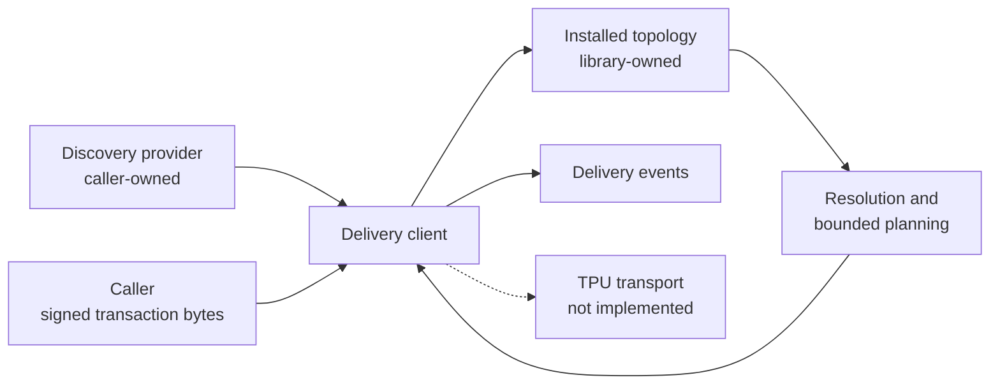
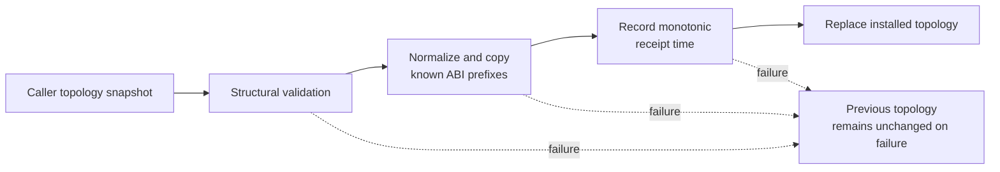
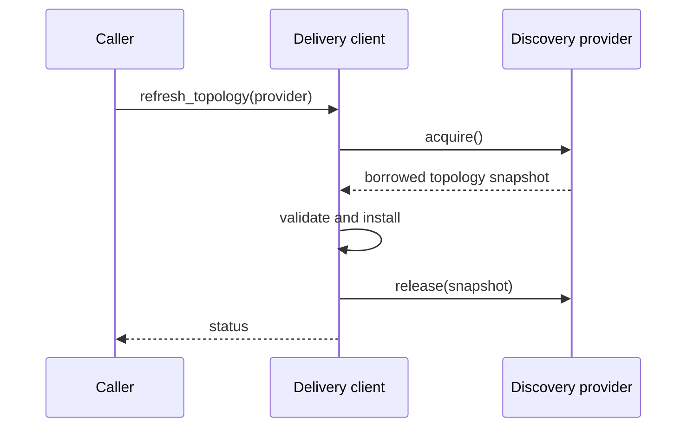
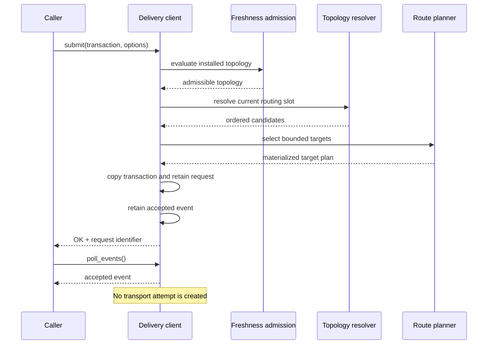

# Architecture

Solana TPU Client separates caller concerns, topology discovery, topology ownership, routing
preparation, delivery lifecycle state, and transport responsibilities.

The current revision implements the delivery state and preparation path through local
request acceptance and event polling. TPU transport is not implemented.

## System Boundary

The caller owns transaction construction and signing. The discovery provider owns the
snapshot only for the duration of acquisition. Installed topology, accepted transaction
bytes, materialized targets, request state, and retained events are owned by the delivery
client.

## Topology Ownership

Installation is transactional. Successful installation retains no caller array pointers.
Later snapshots must use a strictly greater generation than the currently installed
snapshot.

## Discovery Refresh

Refresh is explicit and synchronous. Submission does not invoke discovery implicitly.
After a successful acquisition, provider-owned snapshot storage is released after the
installation attempt, including when installation rejects the snapshot.

## Submission and Event Flow

Successful submission is local acceptance only. Request acceptance and accepted-event
retention are committed atomically.

## Architectural Boundaries

- Public topology records are extensible through explicit structure sizes and array strides.
- Installed topology is library-owned and independent of caller snapshot lifetime.
- Discovery is caller-provided and separate from submission.
- Resolution, bounded route planning, and freshness admission are separate internal stages.
- Request identity is independent of transport-attempt identity.
- Delivery events distinguish request, attempt, and observation vocabulary.
- Transport evidence is distinct from transaction landing or confirmation evidence.
- Application strategy, signing, wallet behavior, and application-specific runtime state
  remain outside the library.

## Architecture Decision Records

- [ADR-0001: Fixed-Layout Trade-Event Parser Prototype](0001-zero-allocation-borsh-deserialization.md)
- [ADR-0002: Use C11 for the Native Integration Layer](0002-use-c11-for-gateway-performance.md)
- [ADR-0003: Signed Transaction Delivery Boundary](0003-transaction-delivery-boundary.md)
- [ADR-0004: Delivery Status Semantics](0004-delivery-status-semantics.md)
- [ADR-0005: Separate Discovery, Routing, Transport, and Observation](0005-topology-routing-transport-separation.md)
- [ADR-0006: Stable C ABI for Transaction Delivery](0006-stable-delivery-c-abi.md)
- [ADR-0007: Topology Snapshot Contract](0007-topology-snapshot-contract.md)
- [ADR-0008: Request and Attempt Event Model](0008-request-attempt-event-model.md)
- [ADR-0009: Deterministic Topology Resolution](0009-topology-resolution.md)
- [ADR-0010: Deterministic Bounded Route Planning](0010-route-planner-policy.md)
- [ADR-0011: Submission Admission and Topology Freshness](0011-submission-admission-freshness.md)
- [ADR-0012: Callable Submission Contract](0012-callable-submission-contract.md)
- [ADR-0013: Request Lifecycle and Event Polling](0013-request-lifecycle-and-event-polling.md)
- [ADR-0014: Use Explicit Caller-Owned Discovery Providers](0014-discovery-provider-interface.md)
